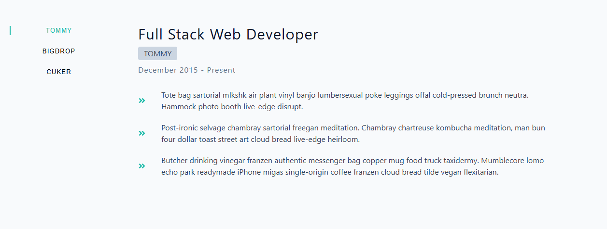

# Tabs Application

A React learning project demonstrating core React concepts through an interactive job information display system.

## Project Overview

This project is a practical application of essential React fundamentals to build an interactive tabs component that fetches and displays job information. Users can click on different company tabs to view corresponding job details.

## Learning Objectives

This project was created to apply and reinforce lessons learned about:

- **State Management**: Using `useState` to manage component state for the current job selection and job data
- **useEffect Hook**: Fetching external API data when the component mounts and handling side effects
- **Data Fetching**: Retrieving job information from an external API and handling loading states
- **Conditional Rendering**: Displaying different content based on loading states and the selected job
- **Functional Components**: Building reusable, functional React components with props and composition

## Project Structure

```
src/
├── Components/
│   ├── BtnContainer.jsx      # Renders clickable tab buttons for each job
│   ├── Duties.jsx            # Displays the list of duties for selected job
│   └── JobInfo.jsx           # Shows detailed information about the selected job
├── App.jsx                   # Main component handling state and data fetching
├── index.css                 # Application styles
└── main.jsx                  # Entry point
```

## Features

- **API Data Fetching**: Fetches job information from an external API using the Fetch API
- **Dynamic Tab Selection**: Click on job tabs to switch between different positions
- **Loading State**: Displays loading message while data is being fetched
- **Component Composition**: Uses modular functional components for better code organization
- **Unique Key Management**: Implements UUID library for generating unique keys for list items

## UI Preview



## Component Details

### App.jsx

- Manages the jobs data state and current selected job index
- Implements `useEffect` to fetch job data on component mount
- Handles loading state display
- Passes state and setters to child components via props

### BtnContainer.jsx

- Maps through jobs array to create a button for each position
- Applies active/inactive styling based on current selection
- Triggers job selection via `setCurrentItem`

### JobInfo.jsx

- Displays company name, job title, dates, and job description
- Uses object destructuring to extract relevant data
- Renders the Duties component for job responsibilities

### Duties.jsx

- Iterates through duties array and renders each responsibility
- Uses react-icons for visual icons next to each duty

## Getting Started

### Installation

```bash
npm install
```

### Running the Application

```bash
npm run dev
```

The application will start on a local development server, and you can view it in your browser.

## Design Reference

[Figma Design File](https://www.figma.com/file/FJC19b9eUWS62HKR8L9Dmn/Tabs?node-id=0%3A1&t=8Rio02EFK1r9ItDW-1)
